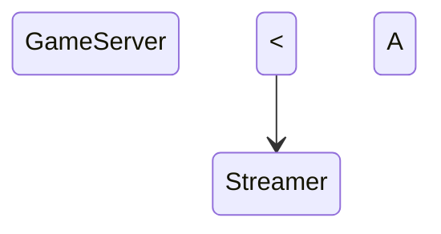

# Chat Wars

## Ideas of how it should work
- each streamer gets an overlay for OBS(or whatever else weirdos use)
- top should have a tug-of-war like score
    - include what emote to spam
    - 

- each streamer's chat spams a specific emote
    - should sub emotes carry more weight? And should we show a free and sub emote to spam?

- have the option for types of games the streamer wants to allow for their chats
    - 
- at the bottom there's a tug of war game, 

## Basic Idea Diagram

## TODO List:

### UI/Overlay 

### Game Server
#### Chat events
 - [ ] get available emotes for each streamer's chat
 - [ ] get each chat message for each streamer's chat

#### Send events to each browser source

